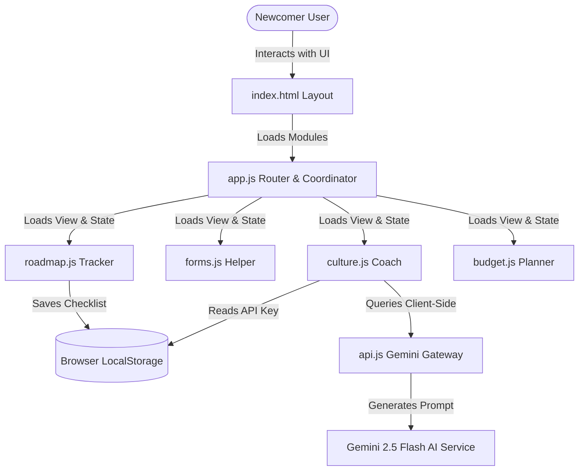
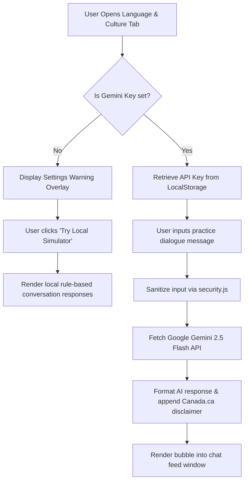
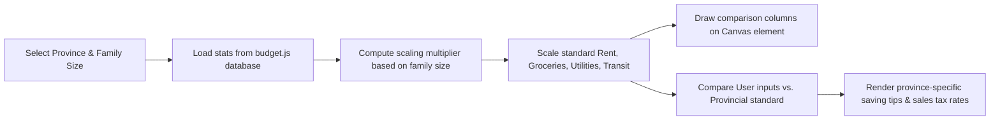

# 🍁 MAPLE AI Guide: Canada AI Newcomer Assistant

MAPLE AI Guide is a comprehensive, production-ready web application designed to support newcomers in their transition to life in Canada. It focuses on absolute client-side data privacy, security, and extreme visual refinement (glassmorphism, obsidian dark mode, smooth micro-animations).

---

## 🛠️ Architecture & Core Workflows

The application is structured as a client-side Single Page Application (SPA) utilizing modular ES6 JavaScript. Data persistence is managed entirely locally via `localStorage` to ensure user privacy, and all AI queries leverage direct, secure client-to-API calls.

### 1. General Application Architecture
The diagram below illustrates the modular component communication and data routing within the SPA:



---

### 2. Chat Simulation & API Gateway Workflow
This workflow demonstrates how the Language & Culture Coach handles API configurations:



---

### 3. Cost of Living calculation Flow
Demonstrates how the dynamic budgeting estimator scales benchmarks based on family size:



---

## 🌟 Core Modules

### 1. Milestone Roadmap Tracker
* **Default Checklists**: Predefined steps categorized into **Pre-arrival**, **First 30 Days**, **Housing & Healthcare**, and **Settling In**.
* **Global Progress Rings**: Live SVG circular progress calculation.
* **Custom Tasks**: Add or remove personalized list items. All progress is persisted securely to `localStorage`.

### 2. Document & Forms Helper
* **Essential Documentation**: Comprehensive, structured step-by-step guides for obtaining a Social Insurance Number (SIN) and opening a Canadian bank account.
* **Health Card Guides**: Select any of the **10 provinces or 3 territories** to inspect local health card waitlists, prerequisites, and link directly to official applications.
* **Driver's License Exchange**: Dedicated workflows outlining how to swap foreign driver's licenses or obtain provincial photo identification cards.

### 3. Language & Local Culture Coach
* **Vocabulary Flashcards**: CSS 3D-flippable flashcards to review local terms (e.g. *Loonie*, *Toonie*, *Double-Double*) and etiquette rules.
* **Roleplay Practice Room**: Practice scenarios (like ordering coffee at Tim Hortons or calling a landlord) using Gemini 2.5 Flash.

### 4. City Selector & Cost of Living Estimator
* **Custom Budgeting**: Sliders to allocate Rent, Food, Utilities, Transit, and Misc budgets.
* **Interactive Canvas Charts**: Real-time rendering comparing user allocations side-by-side with statistical provincial baselines.
* **Regional Insights**: Details local sales taxes (HST/PST/GST) and money-saving rules.

---

## 🔒 Security & Data Quality Guidelines

1. **Input Sanitization (`security.js`)**: All custom checklist additions and chat messages undergo strict HTML escaping to block Cross-Site Scripting (XSS).
2. **Local Key Storage**: API Keys are kept on the client device. No server-side storage exists.
3. **Official Declarations Policy**: All AI replies and guides display:
   > *"Disclaimer: I am an AI assistant, not an official immigration representative. Always verify rules on Canada.ca."*

---

## 🚀 Running Locally

1. **Clone the Repository**:
   ```bash
   git clone https://github.com/laharika15/Maple-AI-Guide.git
   cd Maple-AI-Guide
   ```

2. **Serve Locally**:
   Launch a local server using python (or node):
   ```bash
   python3 -m http.server 8000
   ```

3. **Open the Application**:
   Navigate to [http://localhost:8000](http://localhost:8000) in your web browser.
